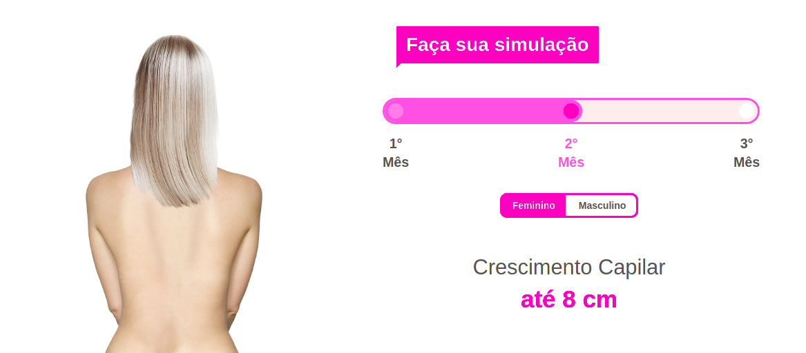

# Hair Growth Simulator

Animated simulator to show hair growth.

In this project, a simulator was developed, which over time, a person's hair size changes after a user changes the number of months.

I was used in this project: html, css, javascript

The code

The system loads some images, and using javascript when the user clicks on the months menu, the system triggers an event that changes the image to the next month's image.
